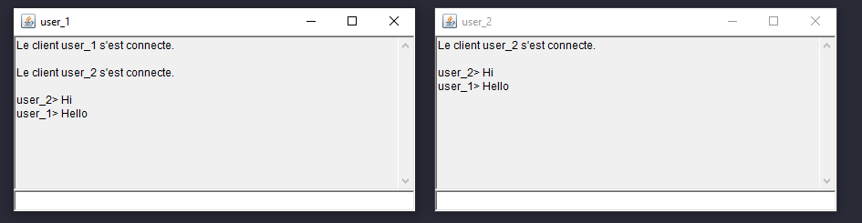

# IRC Chat

**IRC (Internet Relay Chat)** is a method of **real-time** communication via text messages, used primarily for **group** communication in discussion forums called channels, but also for **one-to-one** communication. It is a protocol for chat and messaging between devices connected to the internet. It was developed in the late 1980s and is still in use today, although it has been largely replaced by other forms of instant messaging and chat.

## Getting Started

These instructions will help you set up and run the chat application on your local machine.

### Prerequisites

- Java 8 or later
- Git

### Installation

1. Clone the repository to your local machine using the following command:

   `git clone https://github.com/<YOUR_USERNAME>/IRC-chat.git`
2. Compile the java files

   `javac ThreadClient.java ServeurIRC.java ClientIRC.java`
3. Run the server

   `java ServeurIRC [port_number]`
4. Run the client

   `java ClientIRC [client_name]`

## Usage

The chat application allows users to connect to a server and participate in real-time conversations in various channels.

### Server Usage

- To run the server, navigate to the root directory of the project and use the command above.
- If no port number is specified, the server will listen on port 1973 by default.
- The server manages a list of connected clients and handles incoming connections.
- The server uses the `ThreadClient` class to handle communication with individual clients.
- The `EnvoyerATous()` method sends a message to all connected clients.
- The `EnvoyerListeClients()` method sends the list of connected clients to a specified output stream.
- The `SupprimerClient()` method removes a client from the list of connected clients.
  
   **Configuration options**:

    - The server listens on a specified port number, which can be specified as an argument when running the server.

### Client Usage

- To run the client, navigate to the root directory of the project and use the command above.
- The client uses a GUI to display incoming messages and a text field to send messages to the server.
- The client uses the `ThreadClient` class to handle communication with the server.
- The client establishes a connection to the server using the host and port specified in the `ClientIRC` class.

   **Configuration options**:

    - The client connects to the server using the host and port specified in the ClientIRC class, you should change it to point to your desired server.
    - The client uses a name specified as an argument when running the command as the client name when connecting to the server.

### Client Thread

- Without multithreading, the server would only be able to handle one client at a time, and if a second client tried to connect, the server would have to wait for the first client to disconnect before it could handle the second client. This would make the chat service less responsive and less efficient.

- In this implementation, the server creates a new thread for each incoming client using the `ThreadClient` class. Each thread is responsible for communicating with a single client, and the server can continue to listen for new incoming connections while the existing threads handle communication with their respective clients.

- This allows multiple clients to connect to the server at the same time, and for the server to handle multiple incoming and outgoing messages simultaneously. This makes the chat service more responsive and efficient.

- Additionally, the `ThreadClient` class also uses a `PrintWriter` to send messages to the server and `BufferedReader` to receive messages from the server. That way, the client can send and receive messages at the same time without blocking the execution of the other tasks, which allows the client to handle multiple incoming messages simultaneously.

- Overall, multithreading enables the chat application to handle multiple clients and multiple messages at the same time, which improves the responsiveness and scalability of the application.

## Example usage and GUI

- In this scenario, the server is running on the default port (1973) and is waiting for incoming connections.

- First, user_1 connects to the server and they are able to see the messages sent by the other connected users.

- Then, user_2 connects to the server and sends the message 'hi'. User_1 receives the message 'hi' and sends back a message 'hello' in response.

- After that, user_3 connects to the server and user_1 and user_2 are notified that a new user has connected, user_3.
- Finally, user_3 sends the message 'what's up guys!', and user_1 and user_2 can see the message on their client.

- All users are able to communicate with each other in real-time through the server, and new users can join the chat at any time. The server is able to handle multiple clients and multiple messages simultaneously, thanks to the use of multithreading.
  

## Authors

Mohamed Ali Selmi - [mrdaliselmi](https://github.com/mrdaliselmi)

## License

This project is licensed under the **MIT License** - see the [LICENSE](LICENSE) file for details.

## Acknowledgments

This work is inspired by a **Distributed Systems** university course I took on my second year at the **National Institute of Applied Science and Technology**.
